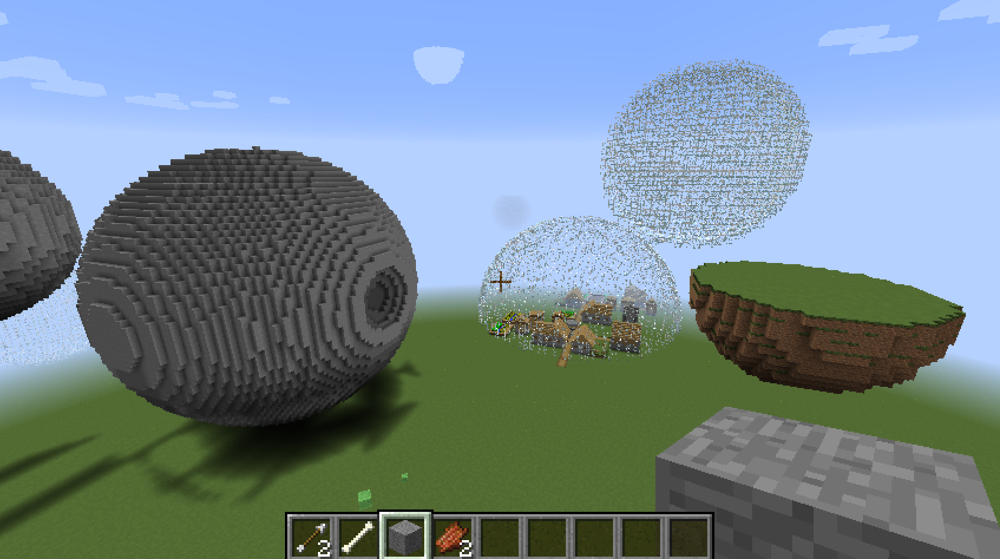

Create spheres of any size in Minecraft. This simple script builds a sphere one ring at a time from the bottom to the top.

## Parameter setup

Choose radius size and block ID (20 = glass; 1 = stone). Increase theta if you are using a larger radius.

```{r}
radius <- 15 # Size of the sphere
z <- seq(-radius, radius)
nz <- length(z) # Number of rings to create
ntheta <- 100 # Number of xy coodinates to create for each ring
theta <- seq(0, 2 * pi, len = ntheta)
blockid <- 20 # use glass
```

## Create sphere coordinates

Create spherical coordiantes using formulae from [Wolfram](http://mathworld.wolfram.com/Sphere.html). This will build one ring for every value in z (height).

```{r}
rings <- array(0, c(ntheta, 2, nz))
for(k in 1:nz){
  rings[, 1, k] <- sqrt(radius ^ 2 - z[k] ^ 2) * cos(theta)
  rings[, 2, k] <- sqrt(radius ^ 2 - z[k] ^ 2) * sin(theta)
}
```

## Chunk circles into grid

Round the coordinates so that each point maps to a specific block in minecraft. Remove duplicate coordinates.

```{r}
sphere <- apply(round(rings), 3, function(x) x[!duplicated(x), , drop = FALSE])
```

## Connect to Minecraft server

Connect to your minecraft server.

```{r}
library(miner)
mc_connect()
```

## Place spheres

Build the sphere blocks. Note that this will build at position 0, 0, 0. Add an offset if you want to build your sphere somehere else.

```{r}
for(j in 1:nz){
    ring <- sphere[[j]]
    for(i in 1:nrow(ring)){
    setBlock(ring[i, 1], j, ring[i, 2], blockid)
  }
}
```


